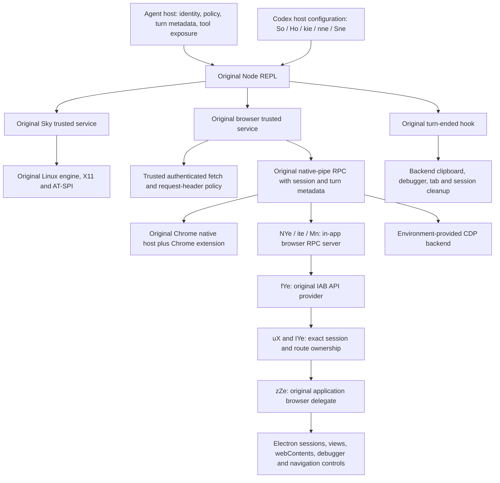

# Linux host integration inventory

Copying `cua_node` preserves the implementation inside that directory. It does not copy all Linux-relevant computer-use behavior in the Codex application. This audit follows the runtime's direct host calls to their original providers and identifies the code, services, and lifecycle inputs needed outside the runtime. Unresolved dependencies below are blockers to full host parity, not non-Linux exclusions.

## Pinned evidence

The source is the official Linux package `26.915.31945`. The ARM64 `resources/app.asar` SHA-256 is `70b6f7f8df841ade1ee9910d93c46c5defaa26914624fe70498983719228bbc9`. The reviewed application sources are:

| Evidence | Path inside `app.asar` | SHA-256 |
| --- | --- | --- |
| Main host | `.vite/build/main-DUHZj4_w.js` | `9e8a3bd79c817064f28693ca26aa1378895e07ab2108c78c42d0ea20dac9d66e` |
| Shared configuration | `.vite/build/src-C3YaUE83.js` | `14c8c23e8b8dfa874d3fb5a50d54fb28eccf55fb83232c3ab29cb7c0ef0a0472` |

[`scripts/host-source-inventory.json`](../scripts/host-source-inventory.json) records exact symbols, source and symbol hashes, line/column coordinates, and UTF-8 byte ranges. Columns use JavaScript's UTF-16 units; byte ranges use UTF-8. This distinction matters in these minified files. The same record identifies the original browser-service source in `cua_node`. Application-source findings were checked against ARM64; the architecture-specific binary/runtime inventories cover both ARM64 and x86-64. Do not assume the entire x86-64 application archive is byte-identical without checking it.

## Runtime boundary graph

## Host configuration and instruction inputs

| Original symbol | Source location | Inputs and effect | Separation assessment |
| --- | --- | --- | --- |
| `So` | Main line 33, column 43288 | App-server version and plugin inventory, feature availability, runtime paths, platform, WSL-path choice, plugin availability; selects Chrome/IAB backends, native computer availability, and unified surfaces | Configuration logic can be reproduced or reused without replacing automation, but its feature gates must be explicit |
| `Lre` | Main; exact range in source inventory | Checks app-server `mcpToolExposure`, plugin installation/enabled/availability, runtime paths, `browserUseTinysky`, and WSL state | Host capability gate, not runtime API code |
| `Ho` | Main line 34, column 3420 | Current authenticated principal, selected runtime/backend configuration, private-process environment, host-service/native-pipe paths | Depends on host account/configuration services; not simply a fixed executable path |
| `kie` | Main line 34, column 4754 | Runtime paths, backend selection, model check, application version/build flavor, authentication telemetry context, trusted service map, permitted environment, and original optional audio flags | A standalone launcher must preserve the relevant values and semantics; it must not fabricate metadata or remove policy checks |
| `nne` | Shared line 69, column 26720 | Builds Node REPL command/environment; sets module paths, trusted code paths, native-pipe connect timeout, request metadata, optional CLI path, and 120-second startup timeout | Mostly separable configuration; the referenced CLI and host services must actually exist |
| `Sne` | Main line 21, column 6278 | Applies the selected Node/runtime command, enabled surfaces, trusted service map, and available browser backends to the original unified MCP plugin | Reusing the template alone misses these filled-in inputs |
| `Gi`, `Pre` | Main line 21 column 6171; line 33 column 41780 | Suppress legacy use-case hints and plugin skills for surfaces handled by unified CUA | Avoids conflicting legacy bootstrap instructions; retaining source guidance does not imply enabling every legacy entrypoint simultaneously |
| `Fie`, `Jo` | Main; exact ranges in source inventory | Synchronize plugin changes, reload/batch-write configuration, and supply per-thread host configuration | Requires lifecycle/config integration beyond one installation-time JSON file |

`nne` maps its minified constants to `NODE_REPL_NATIVE_PIPE_CONNECT_TIMEOUT_MS=1000`, `NODE_REPL_NODE_MODULE_DIRS`, `NODE_REPL_NODE_PATH`, `NODE_REPL_TRUSTED_CODE_PATHS`, `NODE_REPL_REQUEST_META`, `NODE_REPL_SENTRY_USER_ID`, `NODE_REPL_TRACE_META`, and `CODEX_CLI_PATH`. `kie` also supplies `BROWSER_USE_AVAILABLE_BACKENDS`, `BROWSER_USE_TINYSKY_ENABLED`, build-flavor/version settings, model checks, and the original trusted service map. The application honors browser API/capability restrictions and permitted environment settings; a faithful launcher cannot silently discard them.

A material baseline limitation is visible in `So`: this pinned application's unified `computer` surface selection includes a `platform === "darwin"` condition. The Linux native runtime exists, but that does not prove the product enables the same unified native surface on Linux. Do not claim an observed Linux Codex native-task baseline merely from the package's presence.

## Browser IPC: complete direct command boundary

The runtime's `@oai/browser-desktop/scripts/browser-service.mjs` contains the following original boundary producers. Source hashes and exact ranges are in the source inventory.

| Symbol | Responsibility |
| --- | --- |
| `Ta`, `qZ`, `jZ` | Discover native-pipe endpoints; Linux uses `/tmp/codex-browser-use` |
| `qe`, `IH`, `pt` | Read `requestMeta["x-codex-turn-metadata"]`; require effective session and turn identifiers. `pt` uses string `thread_id` when `thread_source === "subagent"`, otherwise string `session_id` |
| `GB`, `NZ` | Discover endpoints, obtain `getInfo`, derive effective APIs/capabilities, and retain/close backend connections |
| `PZ`, `IZ` | Match IAB backends to the exact Codex session and optional application build flavor |
| `hf` | Obtain the original `nodeRepl.nativePipe.createConnection` transport |
| `yf` | Carry session/turn information with requests, apply request-header policy, track turn cleanup, and receive page events |
| `vf` | Register the original Node REPL turn-ended hook and dispatch cleanup for the matching session/turn |

The complete literal request set on `yf` is: `ping`, `getInfo`, `getTabs`, `getUserTabs`, `getUserHistory`, `executeTabRead`, `claimUserTab`, `createTab`, `markTab`, `nameSession`, `followSessionTab`, `attach`, `attachTarget`, `detach`, `detachTarget`, `executeCdp`, `executeCdpWithCachedExpression`, `allowDownload`, `executeUnhandledCommand`, `moveMouse`, and `turnEnded`. It also sends the `webMcpToolInvoked` notification. Cached-expression requests fall back through the original implementation when unsupported. Some methods depend on effective backend capabilities; listing them does not imply every backend accepts them.

The original server-side `ite` class (main line 9, column 2761) wraps `Mn` (line 9, column 673), registering the provider's methods as JSON-RPC handlers. Its outbound event names are `onCDPEvent`, `onCDPDetach`, `onDownloadChange`, `onPageEvent`, and `onBrowserTabMentionsInvalidated`; it handles `moveMouse` and `webMcpToolInvoked` notifications. This is the matching protocol boundary, not an interchangeable raw Chromium remote-debugging connection.

`NYe` (main line 1073, column 47067) creates the original framed native-pipe server, dispatcher, and event forwarding. It depends on `wl`/`Ice` for sockets/framing and on the supplied original API provider for behavior. Its limits are 8 MiB incoming and 64 MiB outgoing. The protocol/socket portion has a separable seam; replacing the API provider with a generic CDP shim would replace meaningful behavior.

## In-app browser provider and required application services

The original provider is `fYe` (main line 1073, column 5858). Its constructor accepts a browser-host lookup, navigation-block listener registration, and options including session-route validation and browser-session access. These are real behavioral dependencies, not optional names.

| Provider behavior | Exact source member | Required original host behavior |
| --- | --- | --- |
| Discovery and capability declaration | `fYe.getInfo`, line 1073 column 11851 | Electron application version; feature/build-flavor settings; valid session route; browser/tab capabilities |
| Session isolation | `getBrowserUseSession`, `ensureBrowserUseSessionRoute`, `getRequiredBrowserHost` | Exact conversation/session ownership and a live matching application browser host |
| Tab creation | `createTabForBrowserUse`, column 19377 | Host panel/tab creation, `openPageForBrowserUse`, lifecycle tracking, visibility/viewport intents, and real `webContents` |
| CDP actions and observation | `executeCdpForBrowserUse`, column 20831; `sendDebuggerCommand`, column 42085 | Real Electron debugger sessions, navigation authorization, page identity checks, input focus emulation, paint/capture leases, navigation readiness, timeouts, detach cleanup |
| Browser capabilities | `executeUnhandledCommand`, column 10138 | Host visibility, viewport, screenshot/capture, and other original command handlers; unsupported capability commands remain rejected |
| Navigation safeguards | `assertCurrentPageAllowed`, column 29206 | Application navigation restriction service and pending-navigation tracking |
| Downloads | `allowDownload` and download grant/listener members | Application browser session, download authorization, and download lifecycle notifications |
| End-of-turn behavior | `turnEnded`, column 14893 | Restore page clipboards; detach/clean debugger state; preserve handed-off/deliverable/persistent tabs; close unmarked temporary tabs; clear activity and capability intents |

`uX` (main line 1073, column 48719) owns the session registry. Its `ensureBackendForSession` constructs `fYe` and `NYe`. `ensureSessionRoute` refuses a missing/stale route; `canServeSession` permits only the correct active session or a narrowly defined pending local-work transition. `IYe` (line 1073, column 77559) is the per-route host adapter.

`IYe` delegates the complete host-facing seam to `uX.getDelegate()`: page and tab reads; page opening; visibility; viewport and capture surfaces; pending-debugger synchronization; page readiness; navigation restriction activation/assertion/tracking/clearing; active-state and cursor updates; WebMCP activity; page closing; and page release. `zZe` (main line 1093, column 5560) supplies these methods through the original application browser controller. Its constructor binds the delegates. `getBrowserSession` uses its browser-session service; `openPageForBrowserUseForRoute` checks the feature gate and creates/opens the original application page; navigation assertions call its navigation-restriction service.

The renderer boundary also includes `frt` (main line 1399, column 11104). It registers `codex_desktop:browser-sidebar-runtime-message` through bootstrap export `Ot` and `codex_desktop:browser-page-event` through `Dt`. Runtime messages pass the original `GWe` schema and owning-window lookup before entering `VQe.handleMessage` (main line 1096, column 8236). Its browser cases forward to the original browser host manager; the annotation-permission case also guards navigation while awaiting permission. Page events pass `lte`, apply the original main-frame process/routing check for `SZ` and `bZ`, then call the browser host manager's `handlePageEvent`. Retaining the preload alone does not install these host handlers. `VQe` has a broad application constructor, while its validated browser-message cases provide a narrower method-reuse seam.

A standalone reuse experiment can inject a host adapter at the `fYe` seam while retaining the original provider and Electron debugger implementation. That is not proof of parity until the adapter supplies the same session, navigation, lifecycle, capture, download, and ownership semantics and passes comparison tests. A fake route, permissive navigation stub, omitted turn cleanup, or replacement input engine would conceal missing behavior.

## Authentication, policies, and turn lifecycle

The original browser service's `BO` calls the trusted fetch interface at `https://chatgpt.com/backend-api/aura/identity` and requires a valid user identity. `Gw` establishes that identity initialization, and `NO` requires it before evaluating the agent request-header policy. `yf.sendSessionRequest` applies the resulting policy for the external-browser backend when the backend advertises the relevant support. These code paths are present in the Linux package. They cannot be deleted or bypassed to claim a fully offline, unauthenticated equivalent.

The compiled original Node REPL and `CODEX_CLI_PATH` provide host authentication/sandbox integration. Retaining those executable files is necessary evidence of code availability, but it does not create a valid account/session or demonstrate that a different agent host supplies the same context. The core and browser runtimes also consume applicable confirmation-policy request metadata. Tests must use real supported metadata delivery rather than inventing a new privileged service.

The application-side Sites/comment clients (`LBe` and `HXe`) require `appServerClient.getBackendRequestAuth`, not only a token. The original `D$` connection delegates this method to `HB` (shared line 702, column 3373). `HB.get` obtains a token through `getAuthToken({refreshToken})`, queries `account/read` with `{refreshToken:false}` and `configRequirements/read` with `{}`, validates their original schemas, and returns `{token, routing, signal}`. Workspace routing must match the token's ChatGPT account. The legacy routing branch is restricted to app-server versions from `0.141.0` up to, but excluding, `0.155.0-alpha.5`, with additional residency, configured URL, network, and FedRAMP checks. The pinned `0.155.0-alpha.9.2` therefore requires the real `workspaceRouting` response. Substituting a legacy route is not equivalent.

`HB` is present in the shared application chunk but is not exported; unchanged extraction is a local implementation task. Its direct helper dependencies are `CC` (abortable promise), `SC` (deferred promise), `RN` (token account claims), `zB`/`BB`/`RB` (routing schemas), `Vv`/`Bv` (version parsing/comparison), and `VB` (account mutation names), plus their transitive dependencies. `D$.requestAuthStatus` sends `getAuthStatus` with `{includeToken:true,refreshToken}`. Its token-cache methods accept only `chatgpt` or `chatgptAuthTokens` auth methods, preserve expiry/refresh and stale-generation checks, and invalidate backend requests on principal changes. `account/updated` and `account/login/completed` notifications clear the cache. The five account mutations are `account/login/start`, `account/logout`, `account/sessions/add`, `account/sessions/switch`, and `account/sessions/logout`; original begin/finish hooks invalidate and coordinate in-flight requests, and transport failure/reset also clears them. Source retention does not replace this notification wiring. Authenticated account state, a valid backend routing response, and service access are separate environment dependencies. This audit inspected source without reading credentials or issuing account requests.

`vf` requires `addTurnEndedHandler`, registers a 4-second hook, and tracks callbacks by exact session/turn. `yf.turnEnded` performs detach cleanup and sends the backend's `turnEnded` request. Merely disposing the tracker removes handlers and clears maps; it is not equivalent to calling `finishTurn`. On the IAB side, `fYe.turnEnded` performs the tab/clipboard/debugger lifecycle above. Client success tests that never deliver turn-ended metadata cannot establish this behavior.

The original `unified-computer-use/.codex-plugin/plugin.json` supplies three MCP hooks: `Stop`, `Interrupt`, and `SubagentStop`. The first two forward `${session_id}` and `${turn_id}`; `SubagentStop` forwards `${agent_id}` as `session_id`. LCU keeps these records unchanged except for the server namespace `cua_repl` → `lcu`. The portable export contains the full native plugin manifest and original MCP policy, plus an explicit lifecycle contract for other hosts. Generic MCP registration alone does not implement these callbacks.

`lcu/codex_hooks.py` delegates TOML updates and hook hashing to the original Codex app-server. Its native writer only accepts user-config writes, so LCU runs it on a disposable copy and commits the resulting file with the installer's concurrent-edit guard. Codex also ignores hook trust supplied by project configuration. For project installs, LCU places only the three exact project-path-specific hook hashes in the selected user's Codex configuration. It does not grant general project trust or bypass hook trust; unrelated hooks, trust state, approval policy, and sandbox settings remain unchanged.

`tests/codex_lifecycle.py` uses the original Linux Codex CLI and runtime with an offline scripted model. A test-only trusted service registers the original `nodeRepl.addTurnEndedHandler` and records its callback. Six native cases pass against the original ARM64 source runtime: a control without hooks, user `Stop`, project `Stop`, overlapping user/project hooks, `Interrupt` through the native `turn/interrupt` API, and `SubagentStop` from a real spawned child thread. Every enabled case receives exactly one callback with the exact live event name and effective session/turn identifiers. The child metadata retains the root `session_id`, so the expected cleanup session is the child `thread_id`, matching original `pt` routing. The control registers the handler but never runs cleanup. Installation is checked for byte-idempotence and unrelated policy preservation. These checked-in tests were executed offline on the original source CLI/runtime; candidate-release wrapper coverage must be recorded separately. A runtime callback test is not proof of IAB tab/clipboard cleanup or equal agent task-success rates.

## External components and separability

| Component | Evidence and disposition |
| --- | --- |
| Linux native engine, original Sky service, unified CUA, browser client/service, REPL | Fully retained in `cua_node`; actual desktop/browser tests still determine behavior |
| Chrome native messaging host, manifests/install/diagnostic scripts | Linux implementation is in the original `chrome` plugin and included in the host inventory |
| Chrome extension itself | Not supplied by the pinned `.deb`; it is a separate original browser extension distribution. Native-host presence alone does not implement its backend. Any bundled extension needs separate source/provenance/integrity treatment |
| IAB native-pipe server and API provider | Original code is in `app.asar`, outside `cua_node`; separable protocol/provider seams exist, but substantial application-host dependencies remain |
| Electron application browser controller and session/navigation services | Linux-relevant `app.asar`/Electron code; unresolved original behavior is a parity blocker, not a platform exclusion |
| Cloud/training/orbit CDP backend | Runtime contains clients and documentation plus backend socket selectors, including `CDP_BROWSER_BACKEND_PIPE_PATH`. A compatible running backend remains an environment dependency; a raw debugging URL is not evidence of the original provider protocol |
| Windows computer-use named-pipe helper | `Ho` selects it only for `platform === "win32"`, and `Qre` requires Windows helper paths. This specific helper is a justified non-Linux exclusion |
| macOS computer-use service app/host pipe and browser peer-authorization addon | `kie`/`Ho` gate the native service-app paths on `darwin`; `kl` immediately returns the non-Darwin branch before loading the native authorization addon. These specific platform integrations are justified non-Linux exclusions |

No exclusion is justified merely because it lives outside `cua_node`. The remaining Linux browser-host dependencies must either be supplied through their original implementation and tested, or reported as unresolved. This document records source dependencies; it does not certify completion of the standalone-host prototype or equality of agent task-success rates.
